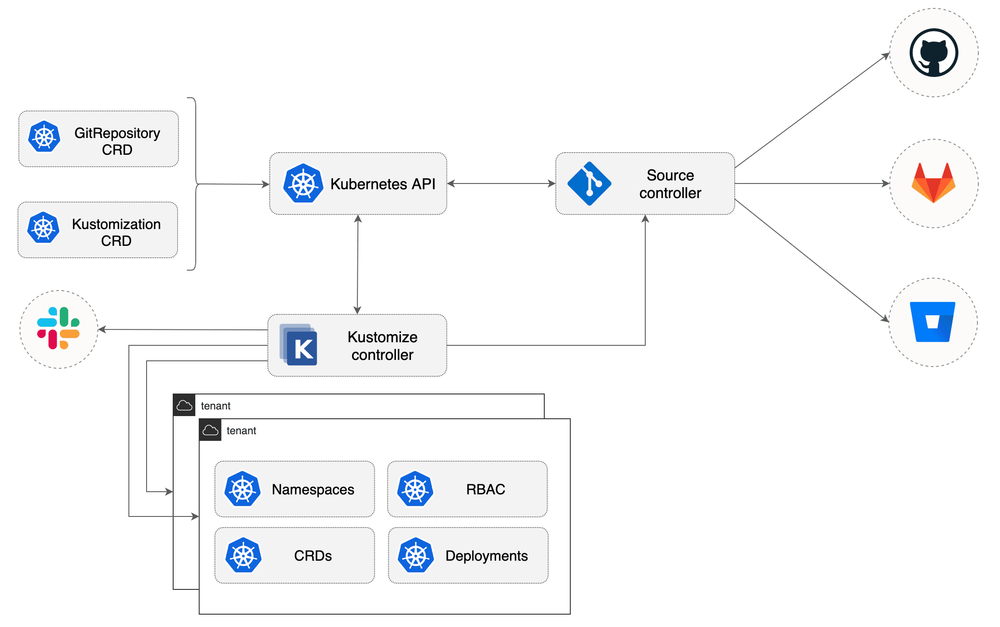
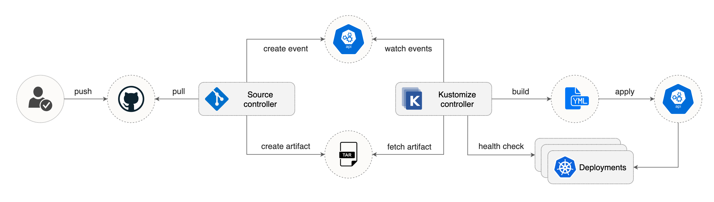
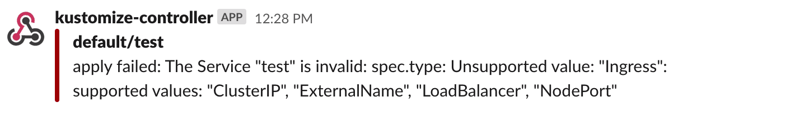
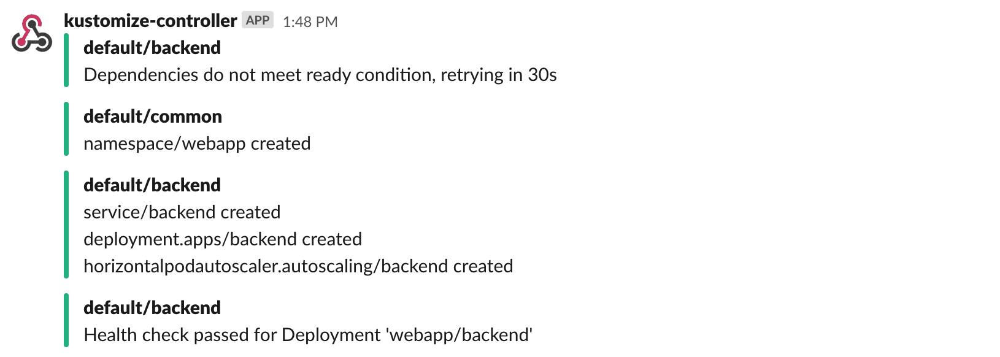

# kustomize-controller

[](https://bestpractices.coreinfrastructure.org/projects/4787)
[](https://github.com/fluxcd/kustomize-controller/actions)
[](https://goreportcard.com/report/github.com/fluxcd/kustomize-controller)
[](https://github.com/fluxcd/kustomize-controller/blob/main/LICENSE)
[](https://github.com/fluxcd/kustomize-controller/releases)

The kustomize-controller is a Kubernetes operator, specialized in running 
continuous delivery pipelines for infrastructure and workloads
defined with Kubernetes manifests and assembled with Kustomize.



Features:
* watches for `Kustomization` objects
* fetches artifacts produced by [source-controller](https://github.com/fluxcd/source-controller) from `Source` objects 
* watches `Source` objects for revision changes 
* generates the `kustomization.yaml` file if needed
* generates Kubernetes manifests with kustomize build
* decrypts Kubernetes secrets with Mozilla SOPS
* validates the build output with client-side or APIServer dry-run
* applies the generated manifests on the cluster
* prunes the Kubernetes objects removed from source
* checks the health of the deployed workloads
* runs `Kustomizations` in a specific order, taking into account the depends-on relationship 
* notifies whenever a `Kustomization` status changes

Specifications:
* [API](docs/spec/v1beta1/README.md)
* [Controller](docs/spec/README.md)

## Usage

The kustomize-controller is part of a composable [GitOps toolkit](https://toolkit.fluxcd.io)
and depends on [source-controller](https://github.com/fluxcd/source-controller)
to acquire the Kubernetes manifests from Git repositories and S3 compatible storage buckets.

### Install the toolkit controllers

Download the flux CLI:

```bash
curl -s https://fluxcd.io/install.sh | sudo bash
```

Install the toolkit controllers in the `flux-system` namespace:

```bash
flux install
```

### Define a Git repository source

Create a source object that points to a Git repository containing Kubernetes and Kustomize manifests:

```yaml
apiVersion: source.toolkit.fluxcd.io/v1beta1
kind: GitRepository
metadata:
  name: podinfo
  namespace: flux-system
spec:
  interval: 1m
  url: https://github.com/stefanprodan/podinfo
  ref:
    branch: master
```

For private repositories, SSH or token based authentication can be
[configured with Kubernetes secrets](https://github.com/fluxcd/source-controller/blob/master/docs/spec/v1beta1/gitrepositories.md).

Save the above file and apply it on the cluster.
You can wait for the source controller to assemble an artifact from the head of the repo master branch with:

```bash
kubectl -n flux-system wait gitrepository/podinfo --for=condition=ready
```

The source controller will check for new commits in the master branch every minute. You can force a git sync with:

```bash
kubectl -n flux-system annotate --overwrite gitrepository/podinfo reconcile.fluxcd.io/requestedAt="$(date +%s)"
```

### Define a kustomization

Create a kustomization object that uses the git repository defined above:

```yaml
apiVersion: kustomize.toolkit.fluxcd.io/v1beta1
kind: Kustomization
metadata:
  name: podinfo-dev
  namespace: flux-system
spec:
  interval: 5m
  path: "./deploy/overlays/dev/"
  prune: true
  sourceRef:
    kind: GitRepository
    name: podinfo
  validation: client
  healthChecks:
    - kind: Deployment
      name: frontend
      namespace: dev
    - kind: Deployment
      name: backend
      namespace: dev
  timeout: 80s
```

> **Note** that if your repository contains only plain Kubernetes manifests, the controller will
> [automatically generate](docs/spec/v1beta1/kustomization.md#generate-kustomizationyaml)
> a kustomization.yaml file inside the specified path.

A detailed explanation of the Kustomization object and its fields
can be found in the [specification doc](docs/spec/v1beta1/README.md). 

Based on the above definition, the kustomize-controller fetches the Git repository content from source-controller,
generates Kubernetes manifests by running kustomize build inside `./deploy/overlays/dev/`,
and validates them with a dry-run apply. If the manifests pass validation, the controller will apply them 
on the cluster and starts the health assessment of the deployed workload. If the health checks are passing, the
Kustomization object status transitions to a ready state.



You can wait for the kustomize controller to complete the deployment with:

```bash
kubectl -n flux-system wait kustomization/podinfo-dev --for=condition=ready
```

When the controller finishes the reconciliation, it will log the applied objects:

```bash
kubectl -n flux-system logs deploy/kustomize-controller | jq .
```

```json
{
  "level": "info",
  "ts": "2020-09-17T07:27:11.921Z",
  "logger": "controllers.Kustomization",
  "msg": "Kustomization applied in 1.436096591s",
  "kustomization": "flux-system/podinfo-dev",
  "output": {
    "namespace/dev": "created",
    "service/frontend": "created",
    "deployment.apps/frontend": "created",
    "horizontalpodautoscaler.autoscaling/frontend": "created",
    "service/backend": "created",
    "deployment.apps/backend": "created",
    "horizontalpodautoscaler.autoscaling/backend": "created"
  }
}
```

You can trigger a kustomization reconciliation any time with:

```bash
kubectl -n flux-system annotate --overwrite kustomization/podinfo-dev \
fluxcd.io/reconcileAt="$(date +%s)"
```

When the source controller pulls a new Git revision, the kustomize controller will detect that the
source revision changed, and will reconcile those changes right away.

If the kustomization reconciliation fails, the controller sets the ready condition to `false` and logs the error:

```yaml
status:
  conditions:
  - lastTransitionTime: "2020-09-17T07:27:58Z"
    message: 'namespaces dev not found'
    reason: ReconciliationFailed
    status: "False"
    type: Ready
``` 

```json
{
  "kustomization": "flux-system/podinfo-dev",
  "error": "Error from server (NotFound): error when creating podinfo-dev.yaml: namespaces dev not found"
}
```

### Control the execution order

When running a kustomization, you may need to make sure other kustomizations have been 
successfully applied beforehand. A kustomization can specify a list of dependencies with `spec.dependsOn`.
When combined with health assessment, a kustomization will run after all its dependencies health checks are passing.

For example, a service mesh proxy injector should be running before deploying applications inside the mesh:

```yaml
apiVersion: kustomize.toolkit.fluxcd.io/v1beta1
kind: Kustomization
metadata:
  name: istio
  namespace: flux-system
spec:
  interval: 10m
  path: "./istio/system/"
  sourceRef:
    kind: GitRepository
    name: istio
  healthChecks:
    - kind: Deployment
      name: istiod
      namespace: istio-system
  timeout: 2m
---
apiVersion: kustomize.toolkit.fluxcd.io/v1beta1
kind: Kustomization
metadata:
  name: podinfo-dev
  namespace: flux-system
spec:
  dependsOn:
    - name: istio
  interval: 5m
  path: "./deploy/overlays/dev/"
  prune: true
  sourceRef:
    kind: GitRepository
    name: podinfo
```

### Deploy releases to production

For production deployments, instead of synchronizing with a branch you can use a semver range to target stable releases:

```yaml
apiVersion: source.toolkit.fluxcd.io/v1beta1
kind: GitRepository
metadata:
  name: podinfo-releases
  namespace: flux-system
spec:
  interval: 5m
  url: https://github.com/stefanprodan/podinfo
  ref:
    semver: ">=4.0.0 <5.0.0"
```

With `ref.semver` we configure source controller to pull the Git tags and create an artifact from the most recent tag
that matches the semver range.

Create a production kustomization and reference the git source that follows the latest semver release:

```yaml
apiVersion: kustomize.toolkit.fluxcd.io/v1beta1
kind: Kustomization
metadata:
  name: podinfo-production
  namespace: flux-system
spec:
  interval: 10m
  path: "./deploy/overlays/production/"
  sourceRef:
    kind: GitRepository
    name: podinfo-releases
```

Based on the above definition, the kustomize controller will apply the kustomization that matches the semver range
set in the Git repository.

### Configure alerting

The kustomize controller emits Kubernetes events whenever a kustomization status changes.

You can use the [notification-controller](https://github.com/fluxcd/notification-controller) to forward these events
to Slack, Microsoft Teams, Discord or Rocket chart.

Create a notification provider for Slack:

```yaml
apiVersion: notification.toolkit.fluxcd.io/v1beta1
kind: Provider
metadata:
  name: slack
  namespace: flux-system
spec:
  type: slack
  channel: alerts
  secretRef:
    name: slack-url
---
apiVersion: v1
kind: Secret
metadata:
  name: slack-url
  namespace: flux-system
data:
  address: <encoded-url>
```

Create an alert for a list of GitRepositories and Kustomizations:

```yaml
apiVersion: notification.toolkit.fluxcd.io/v1beta1
kind: Alert
metadata:
  name: on-call
  namespace: flux-system
spec:
  providerRef: 
    name: slack
  eventSeverity: info
  eventSources:
    - kind: GitRepository
      name: podinfo-releases
    - kind: Kustomization
      name: podinfo-production
```

Multiple alerts can be used to send notifications to different channels or Slack organizations.

The event severity can be set to `info` or `error`.
When the severity is set to `error`, the controller will alert on any error encountered during the
reconciliation process. This includes kustomize build and validation errors, apply errors and
health check failures.



When the verbosity is set to `info`, the controller will alert if:
* a Kubernetes object was created, updated or deleted
* heath checks are passing
* a dependency is delaying the execution
* an error occurs


