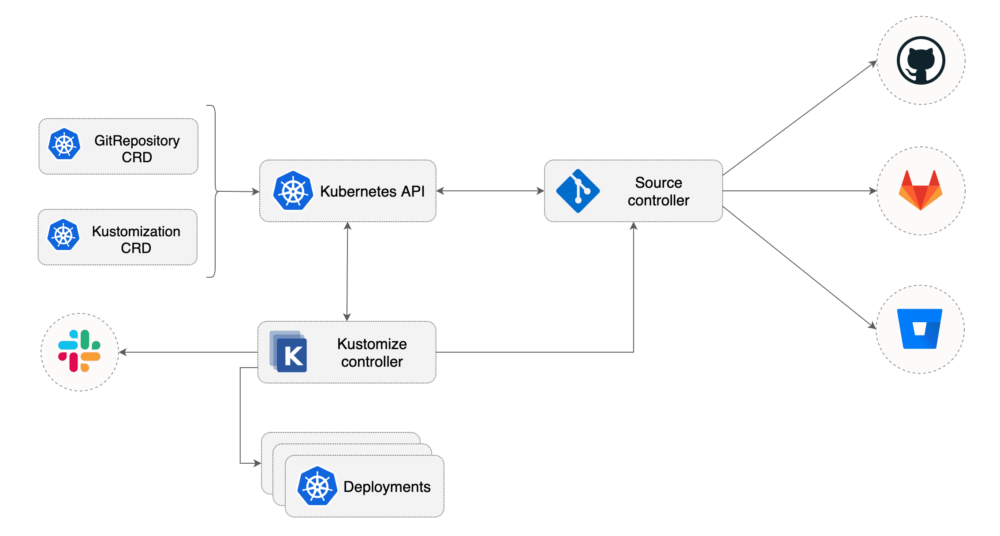

# kustomize-controller

[](https://github.com/fluxcd/kustomize-controller/actions)
[](https://goreportcard.com/report/github.com/fluxcd/kustomize-controller)
[](https://github.com/fluxcd/kustomize-controller/blob/master/LICENSE)
[](https://github.com/fluxcd/kustomize-controller/releases)

The kustomize-controller is a continuous delivery tool for Kubernetes, specialized in running 
CD pipelines inside the cluster for workloads and infrastructure manifests
generated with Kustomize coming from source control systems.



Features:
* watches for [Kustomization](docs/spec/v1alpha1/README.md) objects
* fetches artifacts produced by [source-controller](https://github.com/fluxcd/source-controller) from `Source` objects 
* watches `Source` objects for revision changes 
* generates the `kustomization.yaml` file if needed
* generates Kubernetes manifests with kustomize build
* validates the build output with client-side or APIServer dry-run
* applies the generated manifests on the cluster
* prunes the Kubernetes objects removed from source
* checks the health of the deployed workloads
* runs `Kustomizations` in a specific order, taking into account the depends-on relationship 
* reports on Slack or Discord whenever a `Kustomization` status changes

## Usage

The kustomize-controller is part of a composable GitOps toolkit and depends on
[source-controller](https://github.com/fluxcd/source-controller) to provide the raw Kubernetes
manifests and `kustomization.yaml` file.

### Install the controllers

Install source-controller with:

```bash
kustomize build https://github.com/fluxcd/source-controller//config/default?ref=v0.0.1-alpha.1 \
kubectl apply -f-
```

Install kustomize-controller with:

```bash
kustomize build https://github.com/fluxcd/kustomize-controller//config/default?ref=v0.0.1-alpha.2 \
kubectl apply -f-
```

### Define a Git repository source

Create a source object that points to a Git repository containing Kubernetes and Kustomize manifests:

```yaml
apiVersion: source.fluxcd.io/v1alpha1
kind: GitRepository
metadata:
  name: podinfo
  namespace: default
spec:
  interval: 1m
  url: https://github.com/stefanprodan/podinfo-deploy
  ref:
    branch: master
```

For private repositories, SSH or token based authentication can be
[configured with Kubernetes secrets](https://github.com/fluxcd/source-controller/blob/master/docs/spec/v1alpha1/gitrepositories.md).

Save the above file and apply it on the cluster.
You can wait for the source controller to assemble an artifact from the head of the repo master branch with:

```bash
kubectl wait gitrepository/podinfo --for=condition=ready
```

The source controller will check for new commits in the master branch every minute. You can force a git sync with:

```bash
kubectl annotate --overwrite gitrepository/podinfo source.fluxcd.io/syncAt="$(date +%s)"
```

### Define a kustomization

Create a kustomization object that uses the git repository defined above:

```yaml
apiVersion: kustomize.fluxcd.io/v1alpha1
kind: Kustomization
metadata:
  name: podinfo-dev
spec:
  interval: 5m
  path: "./overlays/dev/"
  prune: "env=dev"
  sourceRef:
    kind: GitRepository
    name: podinfo
  validation: client
  healthChecks:
    - kind: Deployment
      name: podinfo
      namespace: dev
  timeout: 80s
```

> **Note** that if your repository contains only plain Kubernetes manifests,
> you can configure the controller to
> [automatically generate](docs/spec/v1alpha1/kustomization.md#generate-kustomizationyaml)
> a kustomization.yaml file inside the specified path.

A detailed explanation of the Kustomization object and its fields
can be found in the [specification doc](docs/spec/v1alpha1/README.md). 

Based on the above definition, the kustomize-controller fetches the Git repository content from source-controller,
generates Kubernetes manifests by running kustomize build inside `./overlays/dev/`,
and validates them with a dry-run apply. If the manifests pass validation, the controller will apply them 
on the cluster and starts the health assessment of the deployed workload. If the health checks are passing, the
Kustomization object status transitions to a ready state.


You can wait for the kustomize controller to complete the deployment with:

```bash
kubectl wait kustomization/podinfo-dev --for=condition=ready
```

When the controller finishes the reconciliation, it will log the applied objects:

```bash
kubectl -n kustomize-system logs deploy/kustomize-controller | jq .
```

```json
{
  "level": "info",
  "ts": 1587195448.071468,
  "logger": "controllers.Kustomization",
  "msg": "Kustomization applied in 1.436096591s",
  "kustomization": "default/podinfo-dev",
  "output": {
    "namespace/dev": "created",
    "service/podinfo": "created",
    "deployment.apps/podinfo": "created",
    "horizontalpodautoscaler.autoscaling/podinfo": "created"
  }
}
```

You can trigger a kustomize build and apply any time with:

```bash
kubectl annotate --overwrite kustomization/podinfo-dev kustomize.fluxcd.io/syncAt="$(date +%s)"
```

When the source controller pulls a new Git revision, the kustomize controller will detect that the
source revision changed, and will apply those changes right away.

If the kustomization build or apply fails, the controller sets the ready condition to `false` and logs the error:

```yaml
status:
  conditions:
  - lastTransitionTime: "2020-04-16T07:27:58Z"
    message: 'apply failed'
    reason: ApplyFailed
    status: "False"
    type: Ready
``` 

```json
{
  "kustomization": "default/podinfo-dev",
  "error": "Error from server (NotFound): error when creating \"podinfo-dev.yaml\": namespaces \"dev\" not found\n"
}
```

### Control the execution order

When running a kustomization, you may need to make sure other kustomizations have been 
successfully applied beforehand. A kustomization can specify a list of dependencies with `spec.dependsOn`.
When combined with health assessment, a kustomization will run after all its dependencies health checks are passing.

For example, a service mesh proxy injector should be running before deploying applications inside the mesh:

```yaml
apiVersion: kustomize.fluxcd.io/v1alpha1
kind: Kustomization
metadata:
  name: istio
spec:
  interval: 10m
  path: "./profiles/default/"
  sourceRef:
    kind: GitRepository
    name: istio
  healthChecks:
    - kind: Deployment
      name: istiod
      namespace: istio-system
  timeout: 2m
---
apiVersion: kustomize.fluxcd.io/v1alpha1
kind: Kustomization
metadata:
  name: podinfo-dev
spec:
  dependsOn:
    - istio
  interval: 5m
  path: "./overlays/dev/"
  prune: "env=dev"
  sourceRef:
    kind: GitRepository
    name: podinfo
```

### Deploy releases to production

For production deployments, instead of synchronizing with a branch you can use a semver range to target stable releases:

```yaml
apiVersion: source.fluxcd.io/v1alpha1
kind: GitRepository
metadata:
  name: podinfo-releases
spec:
  interval: 5m
  url: https://github.com/stefanprodan/podinfo-deploy
  ref:
    semver: ">=0.0.1-rc.1 <1.0.0"
```

With `ref.semver` we configure source controller to pull the Git tags and create an artifact from the most recent tag
that matches the semver range.

Create a production kustomization and reference the git source that follows the latest semver release:

```yaml
apiVersion: kustomize.fluxcd.io/v1alpha1
kind: Kustomization
metadata:
  name: podinfo-production
spec:
  interval: 10m
  path: "./overlays/production/"
  sourceRef:
    kind: GitRepository
    name: podinfo-releases
```

Based on the above definition, the kustomize controller will build and apply a kustomization that matches the semver range
set in the Git repository manifest.

### Configure alerting

The kustomize controller can post message to Slack or Discord whenever a kustomization status changes.

Alerting can be configured by creating a profile that targets a list of kustomizations:

```yaml
apiVersion: kustomize.fluxcd.io/v1alpha1
kind: Profile
metadata:
  name: default
spec:
  alert:
    type: slack
    verbosity: info
    address: https://hooks.slack.com/services/YOUR/SLACK/WEBHOOK
    username: kustomize-controller
    channel: general
  kustomizations:
    - '*'
```

The alert provider type can be: `slack` or `discord` and the verbosity can be set to `info` or `error`.

The `*` wildcard tells the controller to use this profile for all kustomizations that are present
in the same namespace as the profile.
Multiple profiles can be used to send alerts to different channels or Slack organizations.

When the verbosity is set to `error`, the controller will alert on any error encountered during the
reconciliation process. This includes kustomize build and validation errors, apply errors and
health check failures.


When the verbosity is set to `info`, the controller will alert if:
* a Kubernetes object was created, updated or deleted
* heath checks are passing
* a dependency is delaying the execution
* an error occurs


