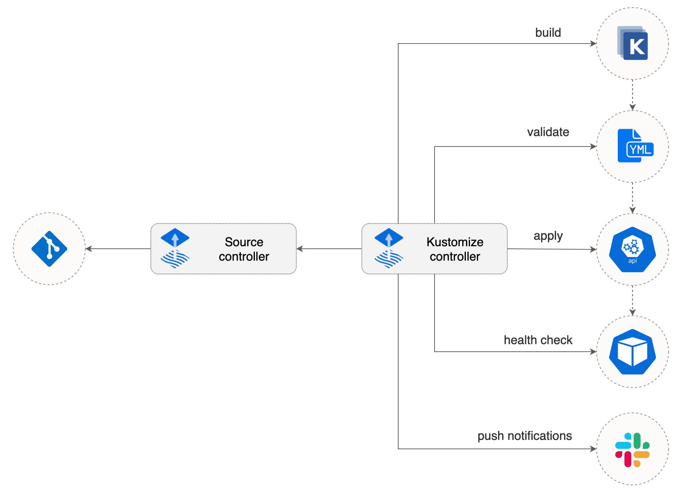

# Kustomize Controller

The Kustomize Controller is a Kubernetes operator, specialized in running 
continuous delivery pipelines for infrastructure and workloads
defined with Kubernetes manifests and assembled with Kustomize.

## Motivation

The main goal is to provide an automated operator that can
bootstrap and continuously reconcile the cluster state
from multiple sources (e.g. infrastructure and application repositories).

When provisioning a new cluster, one may wish to install workloads in a specific order,
for example a validation controller such as OPA Gatekeeper should be up and running before 
applying other manifests on the cluster. Another example is a service mesh admission controller,
the proxy injector must be functional before deploying applications into the mesh.

When operating a cluster, different teams may wish to receive notification about the status
of their CD pipelines. For example, the on-call team would receive alerts about all
failures in the prod namespace, while the frontend team may wish to be alerted when a new version 
of the frontend app was deployed and if the deployment is healthy, no matter the namespace.

When dealing with an incident, one may wish to suspend the reconciliation of some workloads and
pin the reconciliation of others to a specific Git revision, without having to stop the reconciler
and affect the whole cluster.

## Design

The reconciliation process can be defined with a Kubernetes custom resource
that describes a pipeline such as:
- **check** if depends-on conditions are meet  
- **fetch** manifests from Git repository X
- **generate** a kustomization if needed
- **build** the manifest using kustomization X
- **validate** the resulting objects 
- **apply** the objects 
- **prune** the objects removed from source
- **verify** the deployment status
- **alert** if something went wrong
- **notify** if the cluster state changed 



The controller the runs these pipelines relies on
[source-controller](https://github.com/fluxcd/source-controller)
for providing the raw manifests from Git repositories or any
other sources that source-controller could support in the future. 

If a Git repository contains no Kustomize manifests, the controller will
generate the `kustomization.yaml` automatically and label
the objects for garbage collection (GC).

A pipeline runs on-a-schedule and ca be triggered manually by a
cluster admin or automatically by a source event such as a Git revision change.

When a pipeline is removed from the cluster, the controller's GC terminates
all the objects previously created by that pipeline.

A pipeline can be suspended, while in suspension the controller will
stop the scheduler and will ignore any source events.
Deleting a suspended pipeline does not trigger garbage collection.

Alerting can be configured with a Kubernetes custom resource
that specifies a webhook address, and a group of pipelines to be monitored.

The API design of the controller can be found at [kustomize.fluxcd.io/v1alpha1](v1alpha1/README.md).

## Backward compatibility

| Feature                                      | Kustomize Controller    | Flux               |
| -------------------------------------------- | ----------------------- | ------------------ |
| Plain Kubernetes manifests sync              | :heavy_check_mark:      | :heavy_check_mark: |
| Kustomize build sync                         | :heavy_check_mark:      | :heavy_check_mark: |
| Garbage collection                           | :heavy_check_mark:      | :heavy_check_mark: |
| Container image updates                      | :x:                     | :heavy_check_mark: |
| Generate manifests with shell scripts        | :x:                     | :heavy_check_mark: |

Syncing will not support the `.flux.yaml` mechanism as running shell scripts and binaries to
generate manifests is not in the scope of Kustomize controller.

Container registry scanning and automated image updates is not in the scope of Kustomize controller,
could be implemented by a dedicated controller.

## Example

After installing kustomize-controller and its companion source-controller, we
can create a series of pipelines for deploying Istio, and an application made of
multiple services.

Create a source that points to where the Istio control plane manifests are,
and a kustomization for installing/upgrading Istio:

```yaml
apiVersion: source.fluxcd.io/v1alpha1
kind: GitRepository
metadata:
  name: istio
  namespace: kustomize-system
spec:
  interval: 5m
  url: https://github.com/stefanprodan/gitops-istio
  ref:
    branch: master
---
apiVersion: kustomize.fluxcd.io/v1alpha1
kind: Kustomization
metadata:
  name: istio
  namespace: kustomize-system
spec:
  interval: 10m
  path: "./istio/"
  generate: true
  sourceRef:
    kind: GitRepository
    name: istio
  healthChecks:
    - kind: Deployment
      name: istiod
      namespace: istio-system
  timeout: 2m
```

Create a source for the app repo, a kustomization for each service defining depends-on relationships:

```yaml
apiVersion: source.fluxcd.io/v1alpha1
kind: GitRepository
metadata:
  name: webapp
  namespace: kustomize-system
spec:
  interval: 1m
  url: https://github.com/stefanprodan/podinfo-deploy
  ref:
    branch: master
---
apiVersion: kustomize.fluxcd.io/v1alpha1
kind: Kustomization
metadata:
  name: webapp-common
  namespace: kustomize-system
spec:
  dependsOn:
    - istio
  interval: 5m
  path: "./webapp/common/"
  prune: "part-of=webapp"
  sourceRef:
    kind: GitRepository
    name: webapp
  validate: client
---
apiVersion: kustomize.fluxcd.io/v1alpha1
kind: Kustomization
metadata:
  name: webapp-backend
  namespace: kustomize-system
spec:
  dependsOn:
    - webapp-common
  interval: 5m
  path: "./webapp/backend/"
  prune: "part-of=webapp,component=backend"
  sourceRef:
    kind: GitRepository
    name: webapp
  validate: server
  healthChecks:
    - kind: Deployment
      name: backend
      namespace: webapp
---
apiVersion: kustomize.fluxcd.io/v1alpha1
kind: Kustomization
metadata:
  name: webapp-frontend
  namespace: kustomize-system
spec:
  dependsOn:
    - webapp-backend
  interval: 5m
  path: "./webapp/frontend/"
  prune: "part-of=webapp,component=frontend"
  sourceRef:
    kind: GitRepository
    name: webapp
  validate: server
```

Configure alerting for all pipelines in the `kustomize-system` namespace:

```yaml
apiVersion: kustomize.fluxcd.io/v1alpha1
kind: Profile
metadata:
  name: default
  namespace: kustomize-system
spec:
  alert:
    type: slack
    verbosity: info
    address: https://hooks.slack.com/services/YOUR/SLACK/WEBHOOK
    username: kustomize-controller
    channel: general
  kustomizations:
    - '*'
```

